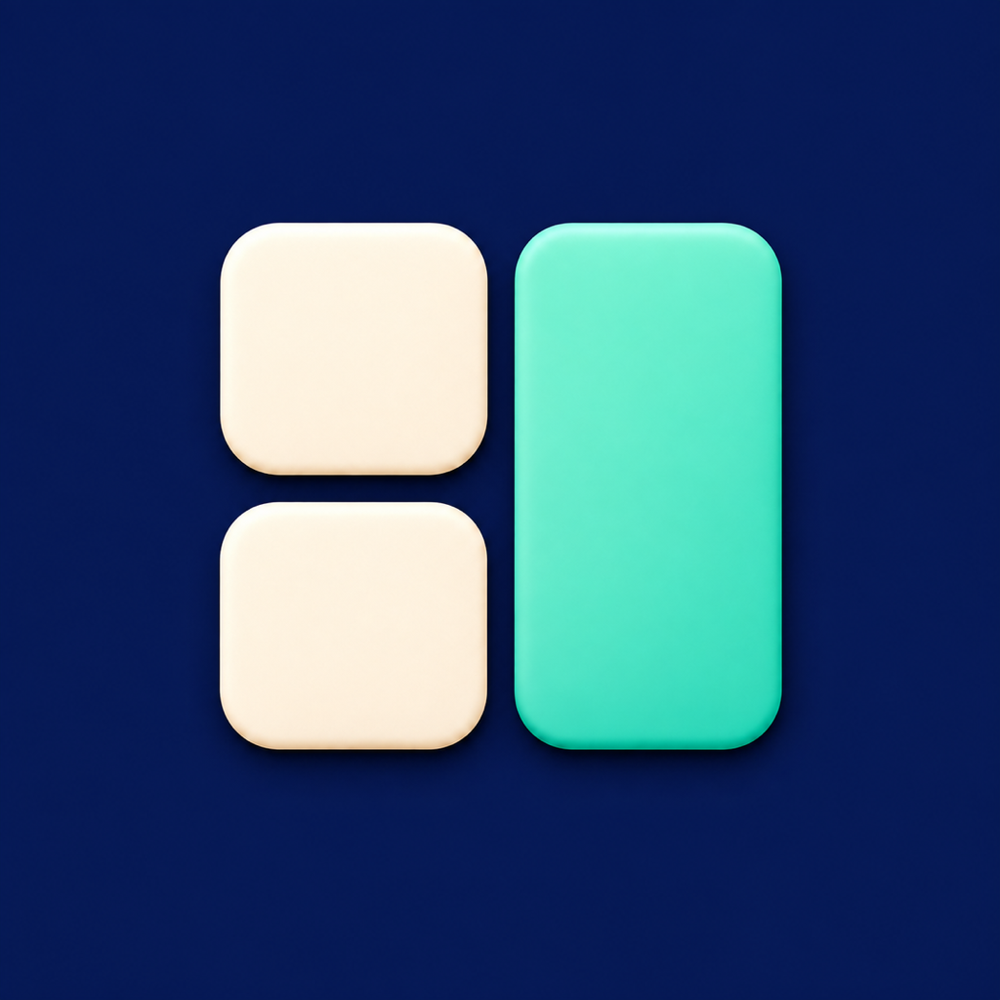
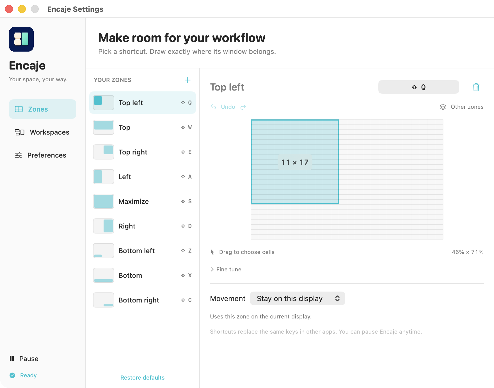

<h1 align="center">Encaje</h1>

Your space, your way.

<strong>English</strong> · <a href="README.es.md">Español</a>

  <a href="https://github.com/StevenACZ/Encaje/releases/latest">Download for macOS</a> ·
  <a href="CHANGELOG.md">What's new</a> ·
  <a href="https://github.com/StevenACZ/Encaje/issues">Report an issue</a>

Encaje is a native macOS window manager for Apple Silicon. Draw your own window
zones, assign shortcuts, and move windows between displays. No account is required.

## What it does

- Create custom zones by dragging on a grid, with exact position and size controls.
- Assign shortcuts using Command, Option, Control and Shift combinations.
- Undo and redo grid edits, and compare zones using selectable reference outlines.
- Move windows between neighboring displays with repeated directional shortcuts.
- Save workspaces and restore the positions of matching open windows.
- Pause from the menu bar or exclude individual apps from shortcuts.
- Set spacing and optional launch at login, with native Accessibility setup.
- Switch instantly between English, Spanish and the system language.
- Receive signed in-app updates through Sparkle 2, with optional daily checks and
  an explicit action to install.

## Install

Requires **macOS 14 or later and an Apple Silicon Mac**.

1. Download the latest Encaje DMG from [Releases](https://github.com/StevenACZ/Encaje/releases/latest).
2. Drag Encaje into Applications and open it.
3. Follow the guide to enable Encaje in System Settings → Privacy & Security →
   Accessibility. Restart Encaje if the guide asks you to.
4. Open configuration from the menu bar to customize your zones and shortcuts.

**The default Shift shortcuts consume their matching uppercase letters in other
apps.** For example, Shift+Q moves a window instead of typing Q. Choose different
shortcuts, pause Encaje, or exclude apps where you need those keys.

| Default shortcut | Zone |
| --- | --- |
| Shift + Q / W / E | Upper left / upper area / upper right |
| Shift + A / S / D | Left / maximize / right |
| Shift + Z / X / C | Lower left / lower area / lower right |

## Make it yours

Drag across a zone's grid to choose its bounds. **Fine tune** exposes exact cell
controls and grid resolution, from 1 to 64 rows and columns. Command+Z undoes a
grid edit; Command+Shift+Z redoes it. **Other zones** adds reference outlines
without changing saved geometry.

Repeated directional shortcuts place a window in its zone, then continue across a
neighboring display. Holding a key does not race through displays; maximize stays
on the current one. Apps can impose minimum or maximum window sizes. Fullscreen
and minimized windows are skipped.

Workspaces restore matching windows that are already open; they do not launch apps
or reopen documents. Named windows require a unique title match. Custom names and
settings stay on your Mac.

## Privacy and updates

Accessibility lets Encaje move windows and handle shortcuts. It does not request
Screen Recording, Microphone, Full Disk Access or Automation permission. See
[Security and privacy](SECURITY.md) for data handling and vulnerability reporting.

Public builds can check for updates daily when enabled. Installing an update
requires your action. Development builds do not consume public updates.

## Build and contribute

Encaje uses Swift 6, SwiftPM, AppKit and SwiftUI, with Sparkle 2 for updates.
See [development setup](docs/development.md), [validation](docs/validation.md)
and [contributing](CONTRIBUTING.md). Release maintainers should follow the
[release checklist](docs/releasing.md).

## License

[MIT](LICENSE)

See [third-party notices](THIRD_PARTY_NOTICES.md) for Sparkle and the adapted update driver.
